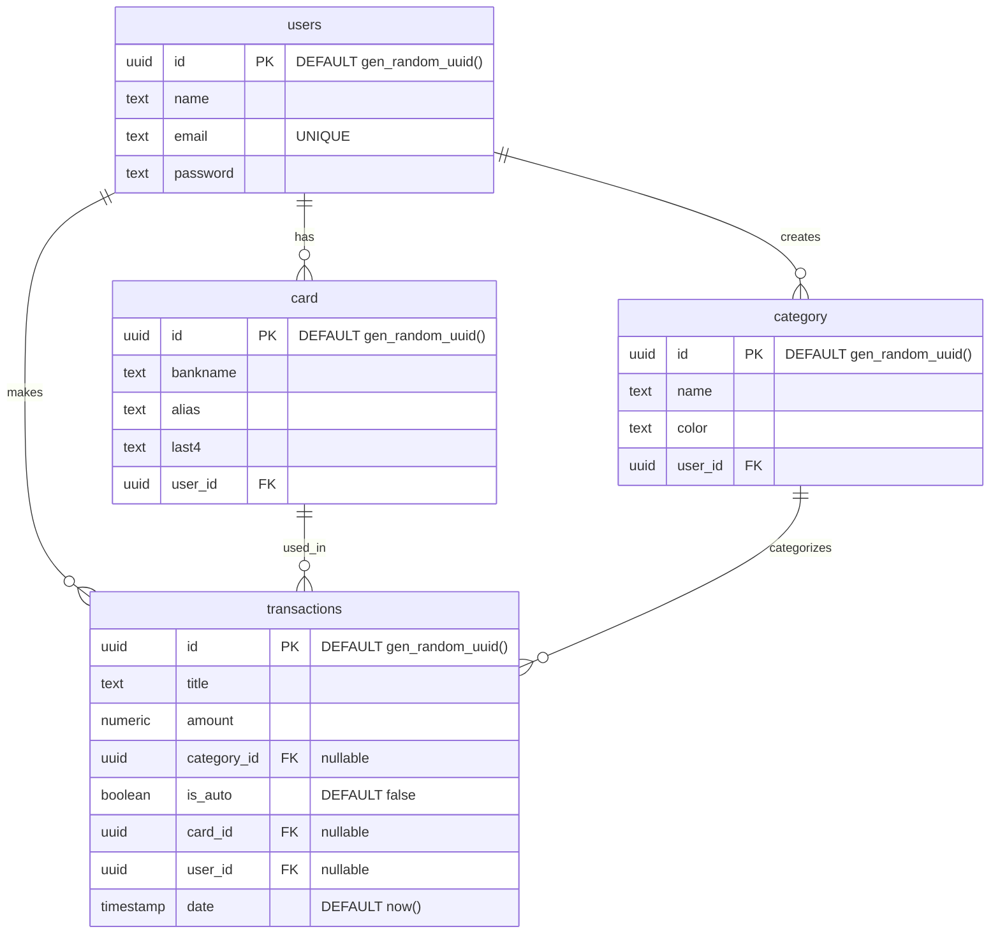

# Money App - Database Schema

This document outlines the PostgreSQL database schema for the Money App backend. It can be provided to other agents or developers to understand the data model.

## Entity Relationship Diagram (ERD)



## SQL DDL Definitions

Below are the exact `CREATE TABLE` definitions currently used in the project.

### 1. Users Table
```sql
CREATE TABLE IF NOT EXISTS public.users (
    id uuid NOT NULL DEFAULT gen_random_uuid(),
    name text NOT NULL,
    email text NOT NULL UNIQUE,
    password text NOT NULL,
    CONSTRAINT users_pkey PRIMARY KEY (id)
);
```

### 2. Card Table
```sql
CREATE TABLE IF NOT EXISTS public.card (
    id uuid NOT NULL DEFAULT gen_random_uuid(),
    bankname text NOT NULL,
    alias text NOT NULL,
    last4 text NOT NULL,
    user_id uuid NOT NULL,
    CONSTRAINT card_pkey PRIMARY KEY (id),
    CONSTRAINT fk_card_user FOREIGN KEY (user_id) REFERENCES public.users(id)
);
```

### 3. Category Table
```sql
CREATE TABLE IF NOT EXISTS public.category (
    id uuid NOT NULL DEFAULT gen_random_uuid(),
    name text NOT NULL,
    color text NOT NULL,
    user_id uuid NOT NULL,
    CONSTRAINT category_pkey PRIMARY KEY (id),
    CONSTRAINT fk_category_user FOREIGN KEY (user_id) REFERENCES public.users(id)
);
```

### 4. Transactions Table
```sql
CREATE TABLE IF NOT EXISTS public.transactions (
    id uuid NOT NULL DEFAULT gen_random_uuid(),
    title text NOT NULL,
    amount numeric NOT NULL,
    category_id uuid,
    is_auto boolean DEFAULT false,
    card_id uuid,
    user_id uuid,
    date timestamp without time zone DEFAULT now(),
    CONSTRAINT transactions_pkey PRIMARY KEY (id),
    CONSTRAINT fk_transactions_user FOREIGN KEY (user_id) REFERENCES public.users(id),
    CONSTRAINT fk_transactions_card FOREIGN KEY (card_id) REFERENCES public.card(id),
    CONSTRAINT fk_transaction_category FOREIGN KEY (category_id) REFERENCES public.category(id)
);
```
